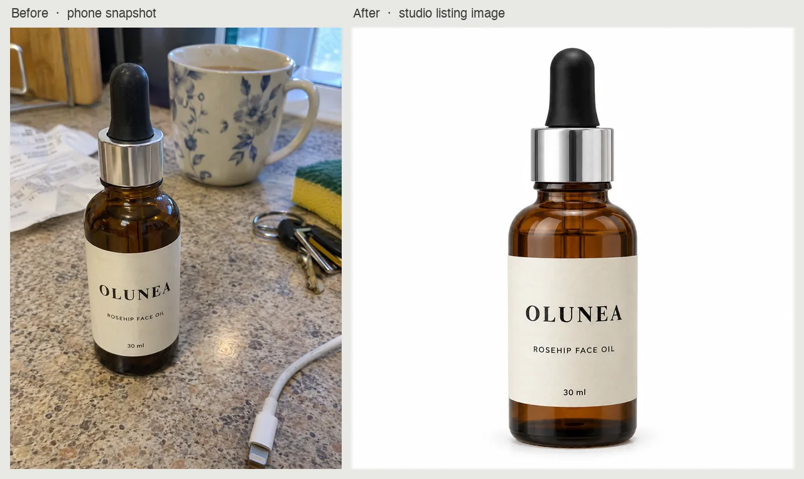
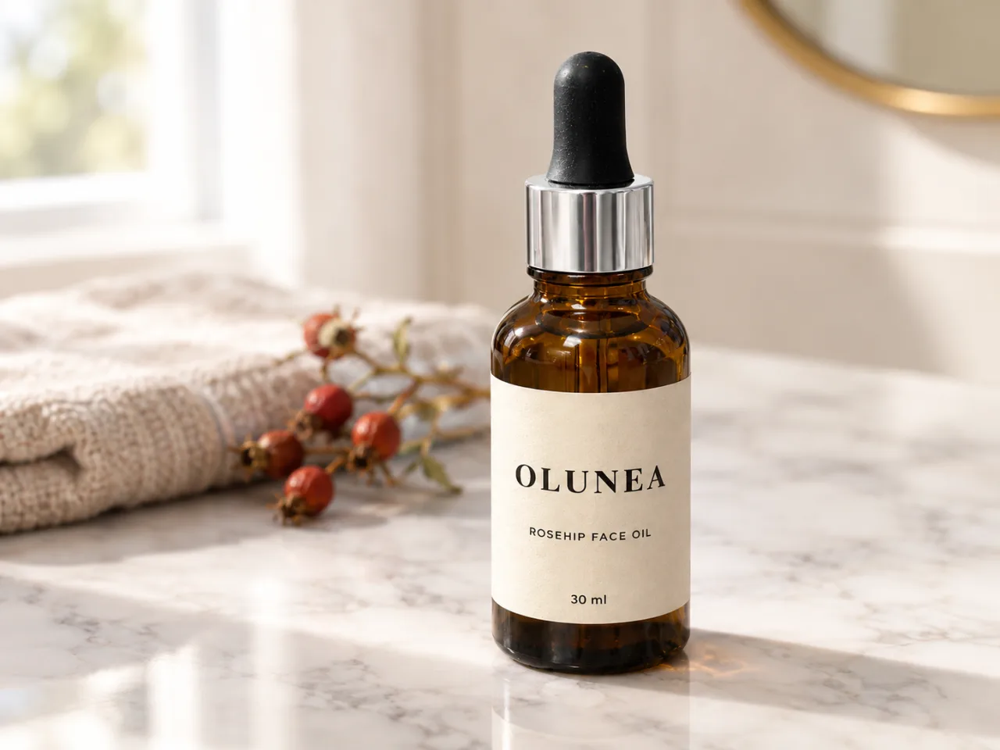

# AI Product Photography Skill

English | [简体中文](./README.zh-CN.md)

Turn a real product photo into studio-quality ecommerce images and lifestyle scenes, from inside Claude Code, Codex, or OpenClaw.

> [!IMPORTANT]
> Rendering needs a [Beatra](https://beatra.ai) account and uses credits. The skill itself is free to install.

| Question | Answer |
| --- | --- |
| **What it does** | Transform a real product photo into a studio-quality ecommerce image, lifestyle scene, or marketplace-ready hero shot with clean backgrounds, professional lighting, and composition guided by confirmed product details. |
| **Requirements** | Python 3.10+ and an agent that loads `SKILL.md` |
| **Cost** | Free to install. Each render uses credits on your Beatra account, and paid steps run only when you ask for that exact render or approve its card. |
| **Works with** | Claude Code, Codex, OpenClaw |

<p align="center"></p>

*A cluttered kitchen-counter phone snapshot of a fictional rosehip face oil, OLUNEA (itself AI-generated as the demo input), turned into a white-background studio listing image with the label text and bottle shape unchanged. AI-generated with Beatra.*

| Skill | Entry point | Version |
| --- | --- | --- |
| [`product-photo-studio`](skills/product-photo-studio) | [SKILL.md](skills/product-photo-studio/SKILL.md) | 0.2.0 |

This repository is published automatically from [beatra-ai/beatra-skills](https://github.com/beatra-ai/beatra-skills/tree/main/skills/product-photo-studio). Report issues there.

## Install

With the [`skills`](https://skills.sh) CLI:

```bash
npx skills add beatra-ai/ai-product-photography-skill
```

With the GitHub CLI:

```bash
gh skill install beatra-ai/ai-product-photography-skill product-photo-studio
```

Or clone this repository and copy `skills/product-photo-studio` into `~/.claude/skills/` for Claude Code,
`~/.agents/skills/` for Codex, or `~/.openclaw/skills/` for OpenClaw.

Or paste this into your agent:

```text
Install the product-photo-studio skill from https://github.com/beatra-ai/ai-product-photography-skill (folder skills/product-photo-studio), then follow its SKILL.md to connect my Beatra account.
```

## Examples

<p align="center"></p>

*The same OLUNEA bottle from the phone snapshot placed in a marble bathroom-vanity lifestyle scene with soft window light, label and shape kept as in the source. AI-generated with Beatra.*

Prompt:

```text
Professional lifestyle product photo for social media. Image 1 is the product reference: the dropper bottle standing on the counter. Match its shape, color, label, label text, and proportions closely, and keep the label text exactly as it appears in Image 1. Leave out the kitchen counter and all other objects from Image 1. Place only the bottle upright on a white marble bathroom vanity, facing the camera, slightly right of center, with a folded linen hand towel and a small sprig of dried rose hips softly out of focus in the background, smaller than the bottle. Soft diffused window light from the left, warm neutral color temperature, gentle highlight on the glass, shallow depth of field with the bottle sharp and the background soft, natural contact shadow falling to the right, clean product edges, consistent lighting direction, no halo or fringe. No added text, logos, or watermarks.
```

## What you get

- **The source product as the visual anchor** — Carry the confirmed shape, color, label, proportions, materials, and included pieces from the source photo into each new background or scene.
- **Marketplace-oriented backgrounds** — Create pure-white Amazon main images, clean Taobao listings, consistent Shopify catalogs, and lifestyle social posts from the same product photo.
- **Scene and lifestyle staging** — Place the product in a contextual scene—kitchen counter, wooden table, marble shelf, or seasonal backdrop—with matching lighting and natural shadow.

## Use cases

- **Marketplace main images** — Clean white-background product photos prepared for Amazon, Taobao, Rakuten, and Shopify listing contexts.
- **Lifestyle and contextual scenes** — Product-in-use images that show the item in a real-world setting, building buyer confidence and desire.
- **Ad and campaign visuals** — Premium hero shots with dramatic lighting and studio-gradient backgrounds for paid ads and landing pages.
- **Social media product posts** — Eye-catching product visuals for Instagram, TikTok, and Pinterest that stop the scroll and drive clicks.

## FAQ

### How do source details guide the new image?

The source photo and confirmed shape, color, label, proportions, materials, and included pieces become the visual reference for the new background and lighting.

### Can I create clean white-background listing images?

Yes. Share the target marketplace and its current image guidance, then choose a clean white background, even studio lighting, and suitable product framing.

### Can I place my product in a lifestyle scene?

Yes. Describe the desired setting—a kitchen counter, wooden table, bathroom shelf, or seasonal backdrop—and the product is placed in that scene with matching lighting and natural shadow.

### Can I refine a specific area of a selected photo?

Yes. Use the selected image as the base and name the reflection, shadow, edge, color, or small defect that needs a focused adjustment.

## Updates

Each installed skill checks for a new version at most once a day, verifies the
official archive before replacing itself, and leaves your installation untouched
if anything fails. Turn it off at any time — see
`references/automatic-updates-and-safety.md` inside the skill.

## License

[MIT-0](LICENSE) — free to use, modify, and redistribute, including
commercially. No attribution required. Same terms as these skills carry on
ClawHub.
